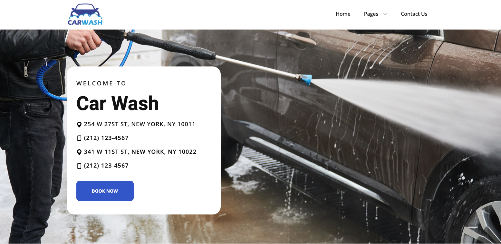

# 🚗 Car Wash Website

A modern and responsive **Car Wash Website** built using **React.js**, **Vite**, **Tailwind CSS**, and **Framer Motion**. The project features a clean UI, smooth animations, responsive layouts, and fast performance across desktop, tablet, and mobile devices.

---


## 🚀 Tech Stack

- React.js
- Vite
- Tailwind CSS
- Framer Motion
- React Router DOM
- React Icons

---


# 📂 Project Structure

```text
src
│
├── assets/
│   ├── images/
│   └── icons/
│
├── components/
│   ├── Navbar/
│   ├── Hero/
│   ├── Features/
│   ├── About/
│   ├── Services/
│   ├── Pricing/
│   ├── Team/
│   ├── Portfolio/
│   ├── FAQ/
│   ├── Contact/
│   ├── Map/
│   ├── Footer/
│   ├── HeroPage/
│   ├── AboutPage/
│   ├── ServicesPage/
│   ├── TeamPage/
│   ├── ContactPage/
│   └── FaqPage/
│
├── data/
├── hooks/
├── pages/
├── styles/
│
├── App.jsx
├── main.jsx
└── index.css
```

---

# 📄 Pages

- Home
- About
- Services
- Pricing
- Team
- FAQ
- Contact

---


# ⚙️ Prerequisites

Before running the project, make sure you have installed:

- Node.js (v18 or later recommended)
- npm (comes with Node.js)
- Git


Clone the project from GitHub:

```bash
git clone https://github.com/lalit-sahu-iphtech/Car-Wash.git
```

---


```bash
cd Car-Wash
```

---

Install all required packages:

```bash
npm install
```

---

Start the Vite development server:

```bash
npm run dev
```

```text
VITE v7.x.x

Local:   http://localhost:5173/
Network: http://192.xxx.x.xx:5173/
```

Open your browser and visit:

```
http://localhost:5173
```

---

# 🌐 Run on Network (Same Wi-Fi)

To access the project from another device on the same network:

```bash
npm run dev -- --host
```

or

```bash
vite --host
```

Then open the **Network URL** shown in the terminal.

Example:

```
http://192.168.1.10:5173
```

---


# 📚 Dependencies

```json
{
  "react": "^19.x",
  "react-dom": "^19.x",
  "react-router-dom": "^7.x",
  "framer-motion": "^12.x",
  "react-icons": "^5.x",
  "tailwindcss": "^4.x",
  "vite": "^7.x"
}
```


#img


